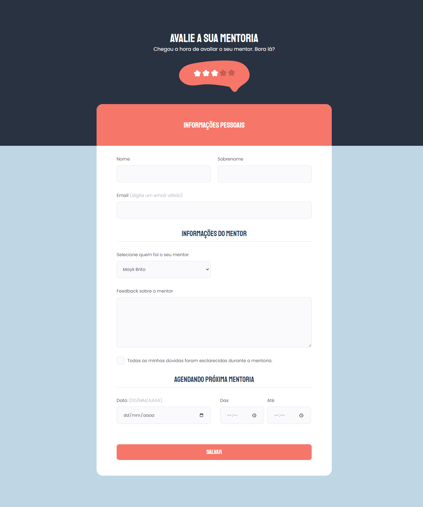

  <h1 align="center"> Explorer Stage 03 - Desafio Formulário Avançado 📝</h1>

## ✏️ Sobre

> Projeto desenvolvido no Stage 3 do curso Explorer da [Rocketseat](https://www.rocketseat.com.br/) 🚀

> Nesse desafio, o objetivo era recriar uma aplicação de um formulário que simula uma avaliação de mentores. ⭐

 

## ⚙ Tecnologias

 

  
  

 

## 💻 Projeto

Para acessar o projeto clique no link abaixo:

[🔗 Clique aqui para acessar](https://brunakarina.github.io./advanced-form/)

## 🎨 Layout

Para acessar o layout do projeto no Figma clique no link abaixo:

🔗 [Ver no figma](https://www.figma.com/file/rgi7KghqHc6vONbsVX6eym/Stage-03---Formul%C3%A1rio-avan%C3%A7ado-(Copy)?node-id=0%3A1&t=HUGgSrrXI74XmFax-0)

## 📫 Contato

  
  

 

<h4 align="center">Made with 💙 by Bruna Karina 👋🏻</h4>